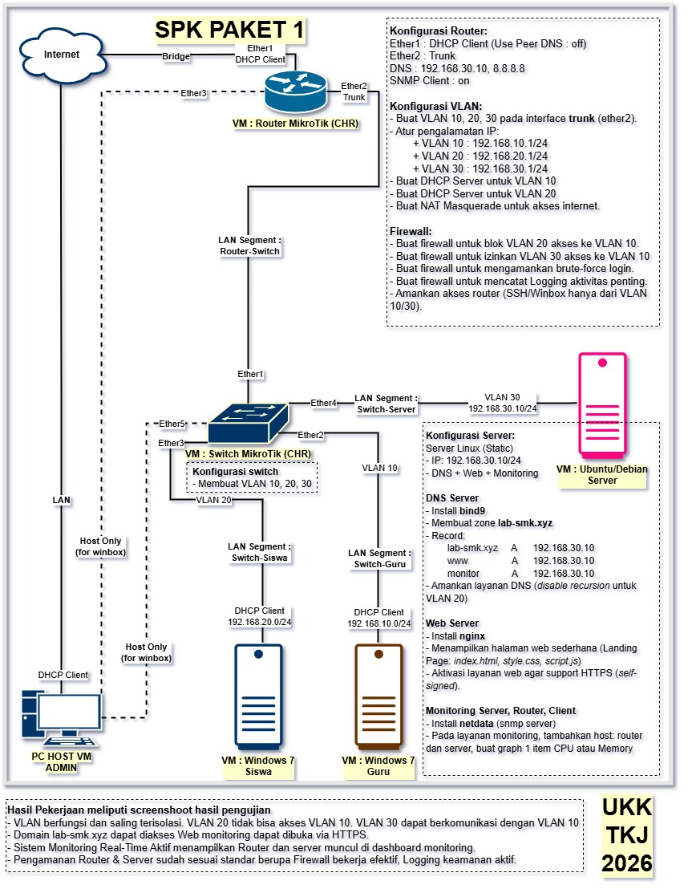

# UKK TKJ 2026 — SPK Paket 1
## Gambaran Umum Pengerjaan

Repositori ini berisi seluruh dokumentasi pengerjaan **UKK TJKT/TKJ SPK Paket 1**: membangun jaringan VLAN dengan Router & Switch MikroTik (CHR), server Linux (DNS, Web, Monitoring), serta client Guru dan Siswa.
---
Topologi lengkap mengacu pada gambar `SPK PAKET 1` yang menjadi acuan seluruh konfigurasi di repo ini.




## 🖥️ Daftar VM yang Perlu Disiapkan

Total ada **5 VM** yang harus dibuat di hypervisor (VirtualBox / VMware / Proxmox, dll), dikerjakan **berurutan** sesuai daftar berikut karena VM belakang bergantung pada VM di depannya (misalnya Server butuh Switch sudah aktif untuk mendapat IP dari VLAN 30).

| # | VM | OS | Peran |
|---|---|---|---|
| 1 | Router | MikroTik CHR | Routing antar-VLAN, DHCP, NAT, Firewall |
| 2 | Switch | MikroTik CHR | Switching VLAN (trunk & access port) |
| 3 | Server | Ubuntu Server 24.04 | DNS, Web, Monitoring |
| 4 | Guru | Windows 7 | Client VLAN 10 |
| 5 | Siswa | Windows 7 | Client VLAN 20 |

---

## 1️⃣ VM Router CHR MikroTik

### Spesifikasi VM
| Item | Rekomendasi |
|---|---|
| RAM | 128 MB (minimum CHR), disarankan **256 MB** agar stabil |
| CPU | 1 vCPU |
| Disk | 128 MB – 1 GB (image CHR .vmdk/.qcow2 bawaan sudah cukup) |
| OS Type | Other Linux (64-bit) / MikroTik CHR image |

### Network Interface (3 buah)
| Interface | Tipe Adapter di Hypervisor | Fungsi |
|---|---|---|
| Ether1 | **Bridged / NAT** (ke internet) | DHCP Client — akses internet |
| Ether2 | **Internal Network**: `Router-Switch` | Trunk ke Switch (VLAN 10/20/30) |
| Ether3 | **Host-Only Adapter** | Akses Winbox langsung dari PC Admin |

> 💡 Nama Internal Network (`Router-Switch`) harus **sama persis** dengan yang dipakai di Ether1 VM Switch pada langkah berikutnya, agar keduanya berada di segmen virtual yang sama.

### 📄 Panduan Konfigurasi
➡️ Ikuti langkah lengkap di **[`1-SETUP-ROUTER.md`](./1-SETUP-ROUTER.md)**
(DHCP Client, DNS, SNMP, VLAN 10/20/30, DHCP Server, NAT, Firewall)

---

## 2️⃣ VM Switch CHR MikroTik

### Spesifikasi VM
| Item | Rekomendasi |
|---|---|
| RAM | 128 MB, disarankan **256 MB** |
| CPU | 1 vCPU |
| Disk | 128 MB – 1 GB |
| OS Type | Other Linux (64-bit) / MikroTik CHR image |

### Network Interface (5 buah)
| Interface | Tipe Adapter di Hypervisor | Fungsi |
|---|---|---|
| Ether1 | **Internal Network**: `Router-Switch` | Uplink trunk ke Router (sama dengan Ether2 Router) |
| Ether2 | **Internal Network**: `Switch-Guru` | Access port VLAN 10 → ke VM Guru |
| Ether3 | **Internal Network**: `Switch-Siswa` | Access port VLAN 20 → ke VM Siswa |
| Ether4 | **Internal Network**: `Switch-Server` | Access port VLAN 30 → ke VM Server |
| Ether5 | **Host-Only Adapter** | Akses Winbox langsung dari PC Admin |

> 💡 Total ada 4 nama Internal Network berbeda yang harus disiapkan di hypervisor: `Router-Switch`, `Switch-Guru`, `Switch-Siswa`, `Switch-Server`.

### 📄 Panduan Konfigurasi
➡️ Ikuti langkah lengkap di **[`2-SETUP-SWITCH.md`](./2-SETUP-SWITCH.md)**
(Bridge VLAN Filtering, trunk & access port, PVID, management port)

---

## 3️⃣ VM Server Ubuntu

### Spesifikasi VM
| Item | Rekomendasi |
|---|---|
| RAM | Minimum 512 GB, disarankan **2 GB** (untuk bind9 + nginx + netdata berjalan bersamaan) |
| CPU | 1–2 vCPU |
| Disk | Minimum 10 GB, disarankan **20 GB** |
| OS | Ubuntu Server 24.04 LTS (mode instalasi minimal/server, tanpa GUI) |

### Network Interface (1 buah)
| Interface | Tipe Adapter di Hypervisor | Fungsi |
|---|---|---|
| ens18 (atau sesuai penamaan hypervisor) | **Internal Network**: `Switch-Server` | Terhubung ke Ether4 Switch, IP Static `192.168.30.10/24` |

### 📄 Panduan Konfigurasi
Pilih **salah satu** metode berikut (hasil akhirnya sama):

- ➡️ **[`3-SETUP-SERVER.md`](./3-SETUP-SERVER.md)** — konfigurasi **manual penuh** langkah demi langkah (disarankan untuk latihan/pemahaman, sesuai standar penilaian UKK yang menilai proses).
- ➡️ Atau gunakan **bash script** (lihat bagian [Alternatif Cepat](#-alternatif-cepat-cheat-code---bash-script) di bawah).

---

## 4️⃣ VM Guru (Windows 7)

### Spesifikasi VM
| Item | Rekomendasi |
|---|---|
| RAM | Minimum 1 GB, disarankan **2 GB** |
| CPU | 1–2 vCPU |
| Disk | Minimum 20 GB, disarankan **32 GB** |
| OS | Windows 7 (32-bit/64-bit sesuai image yang tersedia) |

### Network Interface (1 buah)
| Interface | Tipe Adapter di Hypervisor | Fungsi |
|---|---|---|
| Network Adapter | **Internal Network**: `Switch-Guru` | Terhubung ke Ether2 Switch, DHCP Client dari VLAN 10 (192.168.10.0/24) |

### Konfigurasi
1. Install Windows 7 seperti biasa.
2. Set adapter jaringan ke **Obtain an IP address automatically** (DHCP Client).
3. Setelah Router & Switch aktif, cek IP yang didapat:
   ```
   ipconfig /all
   ```
   Pastikan mendapat IP di range `192.168.10.10–192.168.10.254` dengan gateway `192.168.10.1`.
4. Tes koneksi:
   ```
   ping 192.168.10.1        (gateway)
   ping 192.168.30.10        (server)
   ping lab-smk.xyz          (jika DNS sudah diarahkan ke server)
   ```

> Tidak ada file `.md` terpisah untuk VM ini karena konfigurasinya hanya sebatas DHCP Client bawaan Windows — tidak ada langkah khusus MikroTik/Linux.

---

## 5️⃣ VM Siswa (Windows 7)

### Spesifikasi VM
Sama seperti VM Guru:

| Item | Rekomendasi |
|---|---|
| RAM | Minimum 1 GB, disarankan **2 GB** |
| CPU | 1–2 vCPU |
| Disk | Minimum 20 GB, disarankan **32 GB** |
| OS | Windows 7 |

### Network Interface (1 buah)
| Interface | Tipe Adapter di Hypervisor | Fungsi |
|---|---|---|
| Network Adapter | **Internal Network**: `Switch-Siswa` | Terhubung ke Ether3 Switch, DHCP Client dari VLAN 20 (192.168.20.0/24) |

### Konfigurasi
Sama seperti VM Guru — set DHCP Client, lalu tes:
```
ipconfig /all
ping 192.168.20.1          (gateway) → berhasil
ping 192.168.10.x          (ke VLAN Guru) → HARUS GAGAL (diblok firewall)
ping 192.168.30.10         (ke Server) → HARUS GAGAL (diblok firewall)
```

> Pengujian isolasi VLAN 20 ini penting untuk memverifikasi firewall Router bekerja sesuai requirement (VLAN 20 tidak boleh akses VLAN 10, dan secara topologi juga tidak diberi akses ke VLAN 30).

---

## 🖧 PC Host VM Admin (Opsional, di luar penilaian utama)

Untuk mengakses Winbox ke Router (Ether3) dan Switch (Ether5) secara langsung, PC Host perlu:
- Adapter **Host-Only** yang match dengan jaringan Host-Only Router
- Adapter **Host-Only** kedua yang match dengan jaringan Host-Only Switch
- (Opsional) Adapter **LAN/Bridged** biasa untuk akses umum ke jaringan VLAN untuk pengujian

---

## 📌 Ringkasan Pemetaan Internal Network (Hypervisor)

Pastikan nama **Internal Network** berikut dibuat konsisten di hypervisor sebelum mulai konfigurasi:

| Nama Internal Network | Menghubungkan |
|---|---|
| `Router-Switch` | Ether2 Router ↔ Ether1 Switch |
| `Switch-Guru` | Ether2 Switch ↔ VM Guru |
| `Switch-Siswa` | Ether3 Switch ↔ VM Siswa |
| `Switch-Server` | Ether4 Switch ↔ VM Server |
| Host-Only #1 | Ether3 Router ↔ PC Host Admin |
| Host-Only #2 | Ether5 Switch ↔ PC Host Admin |

---

## 📚 Urutan Pengerjaan & Referensi File

1. Siapkan ke-5 VM sesuai spesifikasi & network interface di atas.
2. Konfigurasi **VM Router** → **[`1-SETUP-ROUTER.md`](./1-SETUP-ROUTER.md)**
3. Konfigurasi **VM Switch** → **[`2-SETUP-SWITCH.md`](./2-SETUP-SWITCH.md)**
4. Konfigurasi **VM Server** → **[`3-SETUP-SERVER.md`](./3-SETUP-SERVER.md)**
5. Setting DHCP Client di **VM Guru** dan **VM Siswa** (lihat bagian 4 & 5 di atas).
6. Lakukan pengujian akhir sesuai checklist di masing-masing file `.md`.

---

## ⚡ Alternatif Cepat (Cheat Code) - Bash Script

Jika sudah paham proses manual dan hanya ingin **mempercepat instalasi ulang** VM Server (misalnya untuk testing berkali-kali), tersedia `setup-server.sh` yang mengotomatiskan seluruh langkah di `3-SETUP-SERVER.md` (kecuali konfigurasi IP static — itu tetap harus manual).

> ⚠️ **Catatan:** untuk keperluan penilaian UKK, sebagian besar skema penilaian menekankan **pemahaman proses manual**. Gunakan script ini hanya sebagai cara cepat untuk latihan/testing berulang, bukan pengganti pemahaman langkah-langkah di `3-SETUP-SERVER.md`.

### Cara Pakai

**1. Konfigurasi IP Static dulu (tetap manual, wajib):**
```bash
sudo nano /etc/netplan/50-cloud-init.yaml
# isi sesuai IP 192.168.30.10/24, gateway 192.168.30.1
sudo netplan apply
ping -c 4 8.8.8.8   # pastikan sudah konek internet
```

**2. Download & jalankan script:**
```bash
wget https://raw.githubusercontent.com/dihkaw/ukk-spk-1-2026/main/sh/setup-server.sh && sudo chmod +x setup-server.sh && sudo ./setup-server.sh
```

Script ini otomatis akan:
- Update sistem
- Install & konfigurasi BIND9 (DNS) untuk zone `lab-smk.xyz`
- Install & konfigurasi Nginx (Web Server) + HTTPS self-signed + landing page (index.html, style.css, script.js)
- Install & konfigurasi Netdata (Monitoring) + SNMP monitoring ke Router + reverse proxy HTTPS untuk `monitor.lab-smk.xyz`
- Konfigurasi firewall dasar UFW

Setelah selesai, langsung lanjut ke tahap [Verifikasi Akhir](./3-SETUP-SERVER.md#7-verifikasi-akhir) di `3-SETUP-SERVER.md`.
